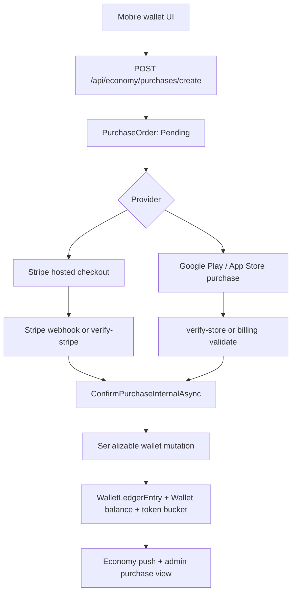
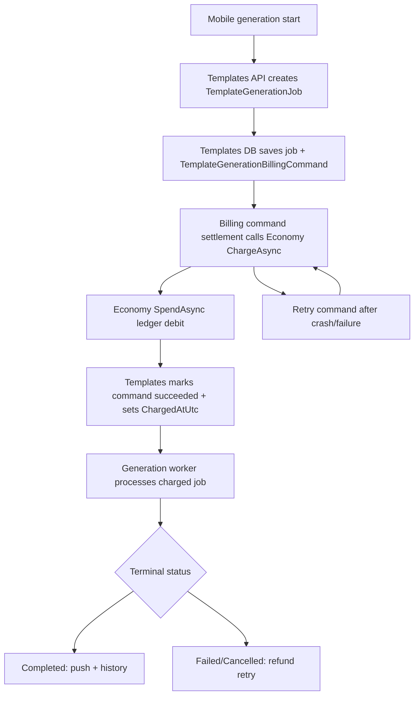

# Аудит уведомлений, токенов, покупок и контроля экономики

Дата аудита: 2026-07-03  
Режим: статический аудит текущего dirty worktree без изменения бизнес-кода  
Обновлено: 2026-07-03 в рамках release-hardening после внедрения durable generation billing command, reconciliation indexes и повторного backend/admin validation.
Область: backend, mobile, admin-web, БД, контракты, уведомления, токены, покупки, контроль экономики

## 1. Краткий вывод

Система экономики уже имеет много production-механизмов: отдельный модуль `Economy`, ledger, уникальные ключи идемпотентности, serializable-транзакции для wallet mutations, webhook dedupe, push-token storage, admin-инциденты, reconciliation worker, durable generation billing command и typed API boundary для admin-web. Это сильная база.

Старый production-блокер на межмодульной границе Templates -> Economy больше не описывается как незакрытая primary-path дыра: generation job и `TemplateGenerationBillingCommand` теперь сохраняются вместе в Templates DB, charge settlement вынесен в retryable command flow, а Economy charge остается идемпотентным по stable generation reason. Если процесс падает после списания, повторная обработка command должна восстановить `ChargedAtUtc`, а reconciliation дополнительно создает incident для `GenerationChargeMarkerMissing` и дает operator action `restore_generation_charge_marker` или `refund_generation_spend`. Текущие факты: `src/Modules/Templates/PetMagic.Modules.Templates.Infrastructure/TemplateGenerationService.StartUserUpload.cs:143`, `TemplateGenerationService.Billing.cs`, `TemplateGenerationBillingReconciliationService.cs`, `EconomyService.Reconciliation.cs`, `EconomyService.IncidentTooling.cs`.

Главный оставшийся production-блокер: реальные внешние провайдеры не проверены этим аудитом. Stripe, Google Play Billing, App Store Server API, FCM, реальные push-токены, deep links и покупки требуют sandbox/device validation перед production-выводом. В коде есть контуры обработки, но результат провайдера без credentials и устройства остается `needs verification`.

## 2. Проверенные факты

- Admin-web обращается к backend через typed API client, а не напрямую к БД: `apps/admin-web/src/lib/api-client.economy.ts` и `apps/admin-web/src/components/use-economy-page-controller.ts:131-233`.
- Backend economy endpoints централизованы в `src/Modules/Economy/PetMagic.Modules.Economy.Api/Endpoints/EconomyEndpoints.cs`.
- Admin economy endpoints централизованы в `src/Modules/Economy/PetMagic.Modules.Economy.Api/Endpoints/AdminEconomyEndpoints.cs`.
- Wallet ledger защищен от части дублей уникальными индексами: `src/Modules/Economy/PetMagic.Modules.Economy.Infrastructure/Data/EconomyDbContext.cs:61-89`.
- Wallet balance имеет DB check constraint на неотрицательный баланс: `src/Modules/Economy/PetMagic.Modules.Economy.Infrastructure/Data/EconomyDbContext.cs:49-59`.
- Wallet mutations выполняются через serializable retry wrapper: `src/Modules/Economy/PetMagic.Modules.Economy.Infrastructure/EconomyService.cs:582-631`.
- Stripe/App Store/Google webhooks имеют processed-event dedupe через `ProcessedWebhookEvents`.
- Mobile регистрирует push token сразу в templates, support и economy: `apps/petmagic-mobile/lib/core/notifications/push_token_registrar.dart:206-226`.
- Mobile notification routing имеет allowlist и safe-route validation: `apps/petmagic-mobile/lib/core/notifications/notification_coordinator.dart:30-40`, `:385-467`.
- Admin имеет UI для incidents/reconciliation/actions: `apps/admin-web/src/components/economy-page-incidents-section.tsx:91-164`.

## 3. Архитектурная карта

### 3.1 Уведомления

| Домен | Backend хранение токенов | Регистрация | Отправитель | Mobile receiver | Состояние |
| --- | --- | --- | --- | --- | --- |
| Template generation | `TemplatePushDeviceToken` | `PUT /api/templates/notifications/push-token` | `FcmTemplateGenerationPushNotificationSender` | `NotificationCoordinator` | Есть terminal push, route `/generations/{id}`, dedupe key |
| Economy wallet/premium | `EconomyPushDeviceToken` | `PUT /api/economy/notifications/push-token` | `FcmEconomyPushNotificationSender` | `NotificationCoordinator` | Есть wallet/premium push, route `/wallet` или `/profile` |
| Support chat | `SupportPushDeviceToken` | support push-token endpoint | `FcmSupportChatPushNotificationSender` | `NotificationCoordinator` | Есть support route `/profile/support` |

Проблема: механизмы разнесены по трем токен-таблицам и трем FCM senders. Это рабочая модель, но нет единого notification inbox, общей истории доставки, единого read/unread состояния для wallet/premium/support. Для generation есть unread/read flow, для wallet/premium push является transient-сигналом.

### 3.2 Покупки и токены

Критичные защиты уже есть:

- `PurchaseOrders` хранят provider/order status/payment ids: `EconomyDbContext.cs:123-143`.
- Внешний payment id уникален: `EconomyDbContext.cs:139-142`.
- Processed webhook event уникален по `(Provider, EventId)`: `EconomyDbContext.cs:145-154`.
- Ledger mutation ищет существующую операцию по `SourceProvider + SourceTransactionId` и по idempotent source/reason: `EconomyService.Internal.WalletAndPurchases.cs:73-133`.
- Negative balance блокируется до записи и DB constraint: `EconomyService.Internal.WalletAndPurchases.cs:18-71`, `EconomyDbContext.cs:49-59`.

### 3.3 Генерации и списание токенов

Граница все еще cross-module и не является одной DB-транзакцией, но primary path теперь защищен durable billing command + idempotent Economy debit. Reconciliation остается обязательной safety net: она ищет spend без `ChargedAtUtc`, charged job без ledger, missing refunds, duplicate ledger mutations и stale unpaid generations.

## 4. Endpoint inventory

### 4.1 Economy client endpoints

| Endpoint | Назначение | Auth/Rate | Файл |
| --- | --- | --- | --- |
| `GET /api/economy/wallet` | Баланс пользователя | Auth, `economy` rate limit | `EconomyEndpoints.cs:45` |
| `GET /api/economy/wallet/ledger` | Ledger пользователя | Auth, `economy` | `EconomyEndpoints.cs:48` |
| `POST /api/economy/wallet/claim-weekly` | Weekly grant | Auth | `EconomyEndpoints.cs:51` |
| `POST /api/economy/wallet/claim-ad` | Ad reward | Auth | `EconomyEndpoints.cs:54` |
| `POST /api/economy/wallet/redeem` | Redeem code | Auth | `EconomyEndpoints.cs:61` |
| `PUT/DELETE /api/economy/notifications/push-token` | Push token economy | Auth | `EconomyEndpoints.cs:65-69` |
| `GET /api/economy/packs` | Token packs | Auth | `EconomyEndpoints.cs:80` |
| `GET /api/economy/wallet/checkout-config` | Payment methods/config | Auth | `EconomyEndpoints.cs:83` |
| `GET /api/economy/premium/plans` | Premium plans | Auth | `EconomyEndpoints.cs:86` |
| `GET /api/economy/premium/status` | Premium status | Auth | `EconomyEndpoints.cs:97` |
| `POST /api/economy/purchases/create` | Создание order | Auth | `EconomyEndpoints.cs:151` |
| `POST /api/economy/purchases/{orderId}/verify-stripe` | Stripe verify | Auth | `EconomyEndpoints.cs:155` |
| `POST /api/economy/purchases/{orderId}/verify-store` | Store verify | Auth | `EconomyEndpoints.cs:159` |
| `GET /api/economy/purchases` | История покупок | Auth | `EconomyEndpoints.cs:148` |
| `POST /api/billing/google/validate` | Google restore/validate | Auth | `EconomyEndpoints.cs:122` |
| `POST /api/billing/apple/validate` | Apple restore/validate | Auth | `EconomyEndpoints.cs:128` |
| `POST /api/economy/webhooks/stripe` | Stripe webhook | `webhooks` rate limit | `EconomyEndpoints.cs:166` |
| `POST /api/economy/webhooks/app-store` | App Store webhook | Webhook validation | `EconomyEndpoints.cs:171` |
| `POST /api/economy/webhooks/google-play` | Google Play webhook | Webhook validation | `EconomyEndpoints.cs:182` |

Legacy payment endpoints were removed after this audit found no mobile/admin consumers:

- `/api/payments/stripe/token-purchase`
- `/api/payments/stripe/subscription`
- `/api/payments/stripe/customer-portal`
- `/api/payments/stripe/diagnostics`

Canonical billing routes remain under `/api/economy/...`: purchases create/verify, premium checkout/manage/cancel, and admin-only Stripe diagnostics.

Direct wallet spend is not exposed as a client API. Token spends are controlled by backend use cases such as template generation billing, watermark unlocks, and admin wallet debits.

### 4.2 Admin economy endpoints

| Endpoint | Назначение | Файл |
| --- | --- | --- |
| `GET /api/admin/economy/ledger` | Ledger search | `AdminEconomyEndpoints.cs:102` |
| `GET /api/admin/economy/dashboard/metrics` | Dashboard metrics | `AdminEconomyEndpoints.cs:103` |
| `GET /api/admin/economy/purchases` | Purchase admin list | `AdminEconomyEndpoints.cs:104` |
| `POST /api/admin/economy/purchases/{orderId}/refund` | Refund | `AdminEconomyEndpoints.cs:105` |
| `GET /api/admin/economy/users/{userId}/subscription-summary` | User subscription summary | `AdminEconomyEndpoints.cs:108` |
| `POST /api/admin/economy/users/{userId}/premium/revoke` | Revoke premium | `AdminEconomyEndpoints.cs:109` |
| `GET /api/admin/economy/subscriptions` | Subscription list | `AdminEconomyEndpoints.cs:112` |
| `GET /api/admin/economy/packs` | Packs admin | `AdminEconomyEndpoints.cs:113` |
| `GET /api/admin/economy/subscription-plans` | Plans admin | `AdminEconomyEndpoints.cs:114` |
| `GET /api/admin/economy/payment-provider-configs` | Provider configs | `AdminEconomyEndpoints.cs:115` |
| `GET /api/admin/economy/subscription-events` | Event log | `AdminEconomyEndpoints.cs:116` |
| `GET /api/admin/economy/incidents` | Incidents | `AdminEconomyEndpoints.cs:117` |
| `GET /api/admin/economy/incidents/{incidentId}` | Incident detail | `AdminEconomyEndpoints.cs:118` |
| `POST /api/admin/economy/reconciliation/run` | Manual reconciliation | `AdminEconomyEndpoints.cs:119` |
| `POST /api/admin/economy/incidents/{incidentId}/resolve` | Resolve incident | `AdminEconomyEndpoints.cs:122` |
| `POST /api/admin/economy/incidents/{incidentId}/reopen` | Reopen incident | `AdminEconomyEndpoints.cs:125` |
| `POST /api/admin/economy/incidents/{incidentId}/actions` | Admin incident action | `AdminEconomyEndpoints.cs:128` |

### 4.3 Template generation endpoints

Template generation имеет отдельный модуль и свои push-token endpoints:

- `POST /api/templates/{templateId}/generations`: `TemplateGenerationEndpoints.cs:52`
- `POST /api/templates/generations/from-result`: `TemplateGenerationEndpoints.cs:62`
- `POST /api/templates/generations/{generationId}/generate-similar`: `TemplateGenerationEndpoints.cs:67`
- `GET /api/templates/generations`: `TemplateGenerationEndpoints.cs:72`
- `GET /api/templates/generations/unread-count`: `TemplateGenerationEndpoints.cs:76`
- `GET /api/templates/generations/events`: `TemplateGenerationEndpoints.cs:80`
- `POST /api/templates/generations/{generationId}/mark-read`: `TemplateGenerationEndpoints.cs:101`
- `POST /api/templates/generations/{generationId}/cancel`: `TemplateGenerationEndpoints.cs:105`
- `PUT/DELETE /api/templates/notifications/push-token`: `TemplateGenerationEndpoints.cs:127-132`

## 5. Database inventory

| Таблица/entity | Назначение | Важные ограничения |
| --- | --- | --- |
| `Wallet` | Текущий баланс пользователя | PK `UserId`, `CK_economy_wallets_Balance_NonNegative` |
| `WalletLedgerEntry` | Источник истины по операциям | Индексы user/time, source/time, unique watermark unlock, unique generation refund, unique source provider transaction |
| `WalletTokenBucket` | Детализация происхождения токенов | `CK_ewtb_RemainingAmount_NonNegative`, user/kind/source indexes |
| `CurrencyPack` | Token packs | Active/currency/provider metadata |
| `PurchaseOrder` | Покупка pack/subscription | Unique provider external payment id |
| `ProcessedWebhookEvent` | Webhook dedupe | Unique `(Provider, EventId)` |
| `PaymentCustomer` | Provider customer binding | Unique provider external customer |
| `SavedPaymentMethod` | Saved payment method | Provider/customer relation |
| `SubscriptionPlan` | Premium plans | Provider/product metadata |
| `UserSubscription` | Premium entitlement state | Provider/customer/user state |
| `PaymentProviderConfiguration` | Admin-managed payment config | Provider/channel/region config |
| `SubscriptionEventLog` | Provider subscription events | Audit/support timeline |
| `EconomyPushDeviceToken` | FCM tokens for economy | Token ownership and disable state |
| `EconomyIncident` | Reconciliation/support incident | Status/severity/category/provider references |
| `EconomyIncidentAuditEntry` | Incident audit trail | Admin/system action log |
| `TemplateGenerationJob` | Generation queue/job | Status, charging/refund timestamps, idempotency indexes |
| `CreditRefund` | Generation feedback/refund | Unique feedback and generation indexes |
| `TemplatePushDeviceToken` | FCM tokens for generation | Token ownership and disabled state |
| `TemplateRealtimeEvent` | Generation realtime events | Used by events/history flow |

## 6. Mobile surface

### 6.1 Wallet and purchases

Mobile wallet data access is concentrated in `apps/petmagic-mobile/lib/features/wallet/data/wallet_repository.dart`.

Current behavior:

- Fetch wallet: `GET /api/economy/wallet`.
- Fetch ledger: `GET /api/economy/wallet/ledger`.
- Fetch packs and checkout config.
- Create purchase through `POST /api/economy/purchases/create`.
- Stripe verify through `POST /api/economy/purchases/{orderId}/verify-stripe`.
- Store verify through `POST /api/economy/purchases/{orderId}/verify-store`.
- Store restore/recovery through billing validate endpoints.
- Push token registration through `PUT /api/economy/notifications/push-token`.

Important state handling:

- `WalletState` tracks buying, pending order, provider, checkout URL, verification state, purchases and highlighted purchase: `wallet_controller.dart:45-72`.
- Stripe flow guards double submit and validates checkout URL: `wallet_controller_checkout.part.dart:6-183`.
- Store flow persists pending purchase before native checkout: `wallet_controller_checkout.part.dart:96-120`.
- Store receipt recovery can settle purchase without local order: `wallet_controller_checkout.part.dart:718-752`.
- Durable pending store purchase has 14-day TTL: `wallet_store_purchase_recovery_store.dart:66-67`.

Risk:

- `selectedPaymentMethod` currently filters `method.isEnabled && method.isStripe`: `wallet_controller.dart:102-119`. Store-native methods may still be exposed elsewhere, but wallet UI must be manually verified to ensure Google Play/App Store purchases are reachable and not hidden by this default selector.
- `WalletLedgerItem` on mobile does not expose richer ledger metadata such as token kind, provider transaction, bucket source, or refund linkage: `wallet_models.dart:35-67`. This limits user/support transparency.

### 6.2 Notifications

Mobile notification entrypoint is `NotificationCoordinator`.

Current protections:

- Allowed route list exists: `notification_coordinator.dart:30-40`.
- Auth initialization registers token only after FCM init and permission: `notification_coordinator.dart:58-120`.
- Dedupe key suppresses repeated foreground messages: `notification_coordinator.dart:183-187`.
- Safe route validation blocks external schemes/query/fragment: `notification_coordinator.dart:385-467`.
- Foreground display messages are typed for support, template_generation, wallet and premium: `notification_coordinator.dart:469-500`.

Gap:

- Push delivery is not persisted into a user-visible notification center. If push is missed, wallet/premium/support state must be discovered only by opening the target screen.

### 6.3 Template generation

Mobile template generation repository calls generation endpoints, maintains active generation cache and unread count. Gallery has unread pill and mark-read flow. Backend terminal push routes to `/generations/{id}`.

Risk:

- Billing is outside template transaction, so mobile may see a failed/orphaned generation differently from actual wallet ledger state. This is backend consistency risk, not a mobile UI-only problem.

## 7. Admin surface

Admin economy page is API-backed and role-gated:

- Admin-only load guard: `apps/admin-web/src/components/use-economy-page-controller.ts:44-48`.
- Ledger/purchase/subscription/provider/incidents queries are through API client: `use-economy-page-controller.ts:131-233`.
- Incident section exposes run reconciliation and actions: `economy-page-incidents-section.tsx:91-164`.

Admin capabilities are good for support:

- purchase search;
- refund;
- user subscription summary;
- premium revoke;
- subscription event log;
- provider configs;
- incidents;
- manual reconciliation;
- incident actions such as retry settlement, manual settle, manual bonus grant and wallet correction.

Gaps:

- Need production verification that `EconomyReconciliationEnabled` is enabled in deployed config. Default is true, but environment override must be checked: `EconomyOptions.cs:55`, `EconomyInfrastructureServiceCollectionExtensions.cs:84-85`.
- Need verify admin action audit events are visible enough for support and compliance workflows.

## 8. Инварианты

| Инвариант | Текущий статус | Evidence | Gap |
| --- | --- | --- | --- |
| Wallet balance не может быть отрицательным | Есть | DB constraint and service check | Нужно нагрузочное/concurrency test на production DB provider |
| Ledger mutation идемпотентна по source/provider tx | Есть | `EconomyService.Internal.WalletAndPurchases.cs:73-133` | Проверить все callers передают стабильный id |
| Webhook event обрабатывается один раз | Есть | `ProcessedWebhookEvents` unique + claim | Runtime replay test needed |
| Purchase paid -> wallet credited once | Частично есть | confirm flow + reconciliation | Needs sandbox provider E2E |
| Refund -> wallet debit once or manual review | Есть в economy | refund reservation/manual review | Needs support runbook |
| Failed/cancelled charged generation -> refund | Есть retry loop | generation worker refund queries | Needs staging/provider evidence |
| Job saved + charge successful + marker save failed | Закрыто primary path + reconciliation | durable billing command, idempotent generation spend, `GenerationChargeMarkerMissing` incident | Нужен deployed crash/reconciliation drill |
| Push token invalid -> disabled | Есть | FCM senders disable invalid token | Needs FCM runtime test |
| Admin never uses DB directly | Есть по admin-web | typed API client | Keep enforced by tests/lint |

## 9. Риски по severity

### Critical

1. Внешние provider flows не подтверждены runtime-аудитом.
   - Где: Stripe webhooks/verify, Google/App Store verify, FCM.
   - Почему критично: статический код не доказывает production-ready интеграцию с sandbox credentials, signing, package/bundle ids и device behavior.
   - Что сделать: обязательный sandbox E2E checklist.

2. Generation billing safety net еще не доказан на deployed staging.
   - Где: durable command и reconciliation есть в code path, но нет provider/staging crash drill evidence.
   - Почему критично: static/unit evidence не доказывает, что deployed workers, reconciliation interval, admin actions и alerts включены именно в production-like окружении.
   - Что сделать: staging drill для crash-after-charge, `restore_generation_charge_marker`, `refund_generation_spend`, alert/support evidence.

### High

1. Уведомления фрагментированы.
   - Есть три token stores и три senders.
   - Нет единой истории уведомлений и read/unread для wallet/premium/support.

2. Store-native wallet purchase UI needs verification.
   - `selectedPaymentMethod` выбирает только Stripe.
   - Нужно проверить фактический UI для Google Play/App Store на Android/iOS.

3. External payment E2E is still not production-proven.
   - Legacy `/api/payments/stripe/*` endpoints were removed and are covered by route absence tests.
   - Stripe sandbox, Google Play, and App Store paid -> credited-once flows still need provider-backed evidence.

### Medium

1. Mobile ledger показывает упрощенную модель.
   - Пользователь и support не видят token kind/bucket/source details.

2. Reconciliation worker зависит от deployed config.
   - Default true есть, но production env нужно проверить.

3. Redeem reward kinds в admin client выглядят узко.
   - `REDEEM_CODE_REWARD_KINDS = ["spark"]` в `apps/admin-web/src/lib/api-client.economy.ts:102`.
   - Нужно сверить с backend contract и product decision по premium_days.

### Low

1. Нет единого developer-facing notification contract document.
2. Нет одной схемы событий для всех push payloads.
3. После каждого migration window нужен route-contract scan, чтобы не возвращались compatibility wrappers без владельца.

## 10. Тесты и валидация

Найдены тестовые контуры:

- Economy unit/integration tests: `EconomyServiceTests*`, `EconomyServiceTests.Reconciliation.cs`, `EconomyServiceTests.PushTokens.cs`, `EconomyWebhookEndpointValidationTests.cs`, `StoreWebhookSecurityValidatorTests.cs`.
- Templates tests: `TemplateGenerationJobProcessorTests.cs`, `TemplateGenerationPushNotificationLocalizerTests.cs`, `TemplatePushTokenEndpointValidationTests.cs`.
- Mobile tests: `notification_coordinator_lifecycle_test.dart`, `push_token_registrar_test.dart`, `wallet_controller_lifecycle_test.dart`, `wallet_page_test.dart`, `stripe_checkout_submit_guard_test.dart`, `store_product_availability_cache_test.dart`.
- Admin tests: `api-client-economy-query.test.ts`, `economy-page.content.test.ts`, `users-admin-actions-hardening.test.ts`, `admin-notifications.test.ts`.

Изначальный аудит был статическим. Последующий release-hardening прогнал backend/admin проверки (`dotnet test PetMagic.slnx --no-restore`, admin `npm run lint`, `npm test`, `npm run build`) и обновил выводы по generation billing. Для финального release gate все равно нужны Flutter full-suite rerun после последних mobile изменений и sandbox/manual E2E с реальными provider callbacks.

## 11. Observability и support

Что уже есть:

- Structured payment webhook logs with provider/event/correlation fields: `EconomyService.Logging.cs`.
- FCM senders log send failures and disable invalid tokens.
- Economy incidents and incident audit entries.
- Reconciliation worker with periodic checks: `EconomyReconciliationWorker.cs:16-55`.
- Admin incident actions and manual reconciliation.
- Monitoring files есть в `deploy/monitoring`, но deployed scraping/alerts не проверялись.

Needs verification:

- Grafana/Prometheus actually deployed and scraping backend.
- Alerts for webhook failures, purchase paid but not credited, ledger mismatch, push delivery failures, refund manual review.
- Support runbook for each incident category.

## 12. Рекомендации по фазам

### Phase 1 - Production blockers

- Провести sandbox E2E для Stripe token pack, Stripe subscription, Google Play token pack, App Store token pack, FCM terminal generation, FCM wallet, FCM support.
- Провести staging drill для generation billing command/reconciliation: crash-after-charge, marker restore, refund spend, duplicate prevention.
- Зафиксировать provider credentials/package/bundle/env checks в release checklist.

### Phase 2 - Support and reconciliation

- Проверить `EconomyReconciliationEnabled` на staging/prod.
- Описать support runbook для incidents.
- Добавить admin view для связанных ledger entries/order/webhook events в одной карточке incident detail.

### Phase 3 - Notification consistency

- Ввести единый notification payload contract.
- Решить, нужен ли persistent notification inbox.
- Унифицировать push token lifecycle policy или оставить раздельные stores, но документировать ownership.

### Phase 4 - Cleanup and contract hardening

- Поддерживать route-contract tests для уже удаленных legacy payment endpoints.
- Расширить mobile ledger DTO/UI для support-critical полей.
- Сверить redeem reward kinds между backend/admin/mobile.
- Добавить contract tests на admin API DTOs и mobile DTO parsing.

## 13. Конкретные задачи

| Задача | Где менять | Зачем | Definition of done | Риск |
| --- | --- | --- | --- | --- |
| Staging drill generation billing reconciliation | Templates + Economy + deploy | Доказать durable command/reconciliation вне unit tests | Crash-after-charge creates/retries/restores marker or refunds idempotently; incident audit visible | Critical |
| Sandbox E2E Stripe token pack | Backend + mobile + Stripe sandbox | Доказать paid -> credited once | Order succeeded, ledger once, push received, webhook replay ignored | Critical |
| Sandbox E2E Google/App Store token pack | Mobile + backend provider verifiers | Доказать store purchase/restore | Native purchase credited once, restore works after reinstall | Critical |
| Проверить FCM на устройстве | Mobile + backend | Доказать terminal push delivery | generation/wallet/support push opens safe route | High |
| Проверить store-native UI selection | Mobile wallet UI | Убедиться, что store methods доступны | Android/iOS видят native purchase path when configured | High |
| Удержать legacy payment endpoints удаленными | Economy API/docs/mobile/admin | Не возвращать contract noise | Route absence tests pass and usage search stays clean | High |
| Расширить ledger response/UI | Economy DTO + mobile/admin | Улучшить support transparency | User/admin видят token kind/source/refund relation без sensitive ids | Medium |
| Проверить deployed reconciliation config | Deployment/env/docs | Инциденты должны создаваться автоматически | `/health`/config evidence confirms worker enabled | Medium |
| Сверить redeem reward kinds | Backend/admin/mobile | Убрать mismatch | Единственный список reward kinds покрыт tests | Medium |
| Добавить notification contract doc | docs + tests | Уменьшить рассинхрон payloads | Contract table + parser tests for each type | Low |

## 14. Итоговая оценка

Economy-модуль близок к production-ready по внутренней целостности wallet/purchases: ledger, уникальные ключи, webhook dedupe, serializable retries, durable generation billing command, incidents и admin tools уже есть. Основная незакрытая зона - не внутренняя wallet-математика, а runtime-доказательство внешних провайдеров и deployed safety nets: sandbox verification, staging reconciliation drill, FCM/device evidence и единая поддерживаемая модель уведомлений.

До production release нельзя считать систему полностью готовой без закрытия Critical пунктов и без ручного/sandbox E2E с реальными provider callbacks, устройствами и staging-доказательством generation billing reconciliation.
