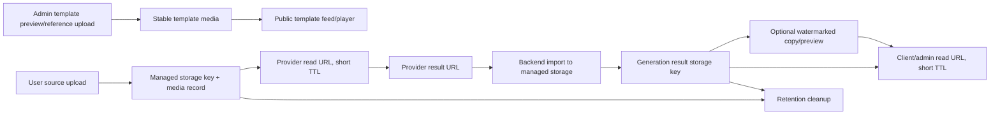

# Generation and Template Media Lifecycle Audit

This document defines the storage/media contract for template assets, user uploads, provider outputs,
generated results, watermarked copies, previews, and cleanup.

## Lifecycle



## Contract

- Template preview and reference media are product content. They must use stable public URLs, must not
  depend on expiring signatures, and are checked by `/health` through `templates_content`.
- User uploads are private generation input. API responses must expose them only through
  `IMediaStorage.CreateReadUrlAsync` with `Templates:UserMediaReadUrlTtlSeconds`.
- Provider source URLs are generated from managed storage only for provider processing. Their TTL must
  be long enough for the provider to download during queue processing.
- Provider result URLs are temporary import sources. They can be stored as operational evidence while a
  job is importing, but completed user-facing responses must use imported managed storage, not provider
  URLs.
- Generated results, watermarked results, and compare previews are private user media. Mobile, public
  API, admin generation list, admin user analytics, download, share, and remove-watermark responses must
  return signed read URLs or `null` if signing fails.
- Cleanup may delete source, normalized, result, and watermarked generation media only after
  `GenerationRetentionDaysAfterCompletion`. It must not delete template preview/reference assets.

## Audit Checks

Run these checks before production deploy:

```bash
dotnet test tests/PetMagic.Modules.Identity.Tests/PetMagic.Modules.Identity.Tests.csproj --filter "FullyQualifiedName~TemplateMediaCleanupProcessorTests|FullyQualifiedName~HttpGeneratedMediaImporterTests|FullyQualifiedName~TemplatesServiceTests|FullyQualifiedName~AdminUserTemplateAnalyticsReaderHardeningTests"
curl https://api.example.com/health
```

Expected `/health` evidence:

- `templates_content` is healthy;
- no active production-visible template has missing preview/reference media;
- no preview/reference URL returns 404 or unsupported video metadata.

Optional DB probe for unsafe completed-generation URLs:

```sql
SELECT "Id", "Status", "ResultUrl", "WatermarkedResultUrl", "ProviderResultUrl"
FROM templates_generation_jobs
WHERE "Status" = 3
  AND (
    "ResultUrl" ILIKE 'http%'
    OR "WatermarkedResultUrl" ILIKE 'http%'
  );
```

The expected production result is zero rows for managed private storage. If rows exist, migrate them to
managed storage keys or re-import before launch.

## Known Risks

- R2 privacy depends on bucket/CDN policy. The application now signs browser-facing generation media,
  but `R2.PublicBaseUrl` still exists for stable template assets and legacy managed URL resolution.
- Local development storage is public under `/templates-media`; this is acceptable only for local/staging
  testing, not as a privacy model.
- Provider result URLs can expire before import. That must fail the job safely with
  `templates.generated_media_import_failed`; completed jobs should not depend on those provider URLs.
- `GenerationRetentionDaysAfterCompletion` is currently a destructive media-retention policy. Product
  must decide whether completed results should remain available longer than the default retention window.

## Production Checklist

- Template preview/reference assets are in stable public storage and pass `templates_content`.
- User upload/result bucket or prefix is private; browser access goes through signed URLs only.
- `UserMediaReadUrlTtlSeconds` is greater than provider download latency plus queue handoff margin.
- Provider result imports are monitored for failures and do not expose provider URLs in user responses.
- Cleanup retention matches product policy for gallery/history availability.
- Admin generation/user analytics screens show signed URLs or no media, never raw private storage keys.
